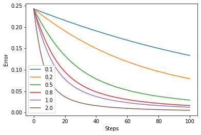

# TSAI - END3 Session 2 Assignment
*Group Members: Dhruba Adhikary, Phani Nandula, Prateek Maheshwari, Sujit Ojha*

# Assignment Objective
1. Rewrite the whole excel sheet showing backpropagation. Explain each major step, and write it on Github.  
   a. Use exactly the same values for all variables as used in the class  
   b. Take a screenshot, and show that screenshot in the readme file  
   c. Excel file must be there for us to cross-check the image shown on readme (no image = no score)  
   d. Explain each major step  
   e. Show what happens to the error graph when you change the learning rate from [0.1, 0.2, 0.5, 0.8, 1.0, 2.0]   


# Solution
## Q 1. Rewrite the whole excel sheet showing backpropagation. Explain each major step.
- [Notebook](Back_Prop_NN.ipynb.ipynb) and [Excel Sheet](Book1.xlsx)

## Q 1.a Use exactly the same values for all variables as used in the class


## Q 1.d Major Steps
Below are the defined major steps in this exercise  
   a. Initialization - Weights of the neural network  
   b. Utility functions - Sigmoid Activation function  
   c. Forward propagation - Given the weights and inputs this function calculates the predicted output of the netowrk  
   d. Error Calculation - Calculate Squared Error between predicted output and target values  
   e. Gradient functions for each weights of the netowrk - These functions calculate the gradients of Error with respect to weights  
   f. Updation of weights - We have incorporated updation of weights for each iteration in a ```for loop```  
   g. All the above are run for different learning rates 

Below images shows the paths that contribute to the updation of weight w1


Below image shows the paths that contribute to the updation of weight w8

## Q 1.e. Error graph with different learning rate [0.1, 0.2, 0.5, 0.8, 1.0, 2.0] 



Note
- With higher learning rate, we are reaching global minima for the weights faster. (assuming simple problem and the error function will be concave with one only minima)
